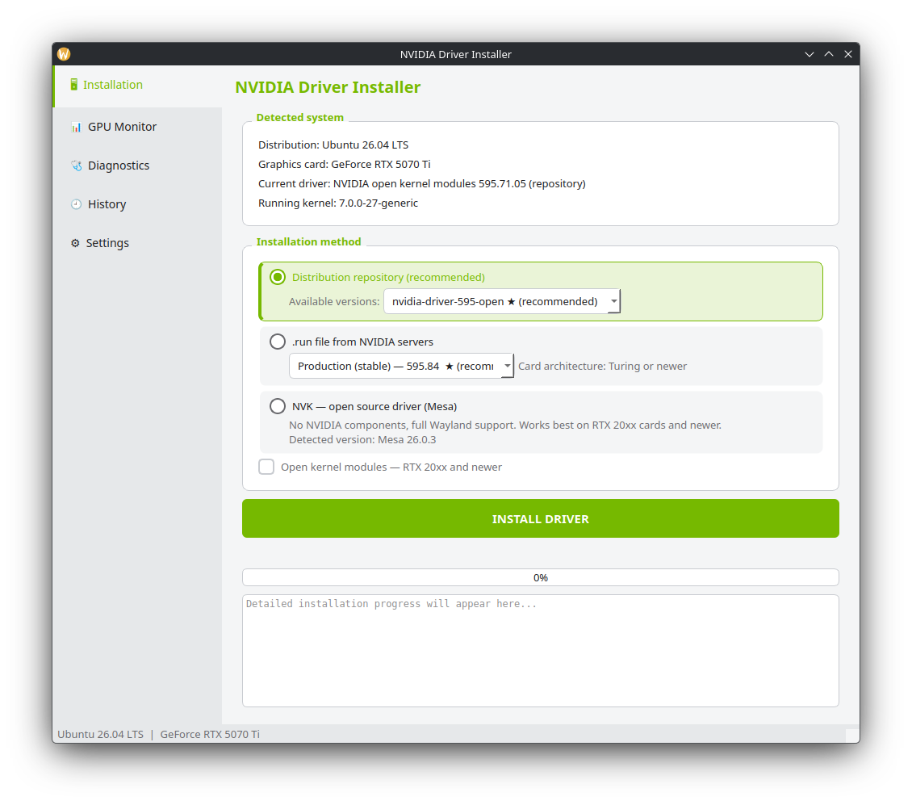
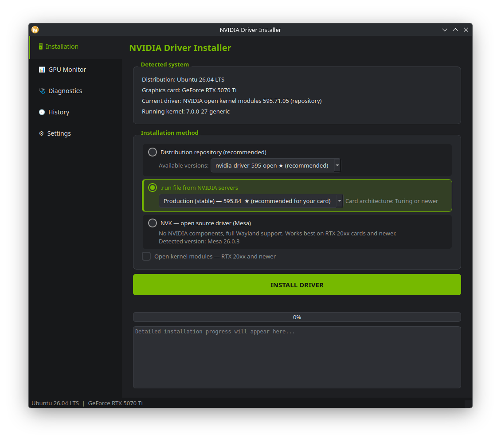

# NVIDIA Driver Installer

> [English README](README.md)

Prosty w obsłudze program graficzny (PySide6) do **w pełni automatycznej
instalacji sterowników NVIDIA na Linuksie**. Wybierasz metodę, klikasz jeden
przycisk, podajesz raz hasło administratora — resztą zajmuje się program.

---

## Zrzuty ekranu

| Jasny motyw | Ciemny motyw |
|:---:|:---:|
|  |  |

---

## Funkcje

**Metody instalacji sterownika:**
- **NVK** — otwartoźródłowy sterownik NVIDIA (Mesa), bez komponentów proprietary, pełna obsługa Wayland
- **Repozytorium** — instaluje sterownik z oficjalnego repozytorium dystrybucji; dostępne wersje są wykrywane automatycznie
- **Plik Run (Production / New Feature / Beta / Legacy)** — pobiera i instaluje bezpośrednio z serwerów NVIDIA

**Dodatkowe funkcje:**
- Automatyczne wykrywanie GPU i zainstalowanego sterownika
- Monitor GPU w czasie rzeczywistym: temperatura, użycie, pamięć VRAM, pobór mocy, wentylator
- Diagnostyka systemu ze szczegółowym raportem błędów (Secure Boot, DKMS, nagłówki jądra, logi)
- Historia instalacji z pełnymi logami
- Automatyczna konfiguracja: `nvidia_drm modeset=1` (Wayland), blokada nouveau, aktualizacja initramfs
- Obsługa open kernel modules (architektura Turing i nowsze, RTX 20xx+)
- Interfejs po polsku i angielsku (wykrywany automatycznie z ustawień systemu; wybór w Ustawieniach ma pierwszeństwo)
- Motyw jasny i ciemny

---

## Testowane dystrybucje

| Rodzina | Dystrybucje |
|---|---|
| Arch | Arch Linux, CachyOS, EndeavourOS |
| Fedora | Fedora 44, Nobara 43 |
| Debian | Debian 13, Kubuntu 26.04 LTS, Linux Mint 22.3 |

Każda dystrybucja przeszła pełny cykl testowy (repozytorium → NVK → .run →
repozytorium) na karcie GeForce RTX 5070 Ti. Inne dystrybucje z tych rodzin
(Ubuntu, RHEL, Rocky Linux, AlmaLinux itd.) również powinny działać, ale nie
były testowane bezpośrednio.

---

## Wymagania

- Linux z kartą graficzną NVIDIA
- `python3` (na Debianie / Kubuntu / Mint dodatkowo pakiet `python3-venv`)
- Dostęp administratora (sudo)

`PySide6` i `requests` są instalowane automatycznie do lokalnego środowiska
wirtualnego przy pierwszym uruchomieniu — nie musisz instalować ich ręcznie.

---

## Jak uruchomić

```bash
chmod +x NVIDIA-Installer.run   # tylko za pierwszym razem
./NVIDIA-Installer.run
```

Skrypt automatycznie tworzy środowisko wirtualne Pythona (`.venv`), instaluje
zależności (`PySide6`, `requests`) i uruchamia program. Pierwsze uruchomienie
może potrwać kilka minut z powodu pobierania `PySide6` — w trakcie
przygotowywania środowiska pokazywane jest okno z postępem.

Na Debianie / Kubuntu / Mint moduły `venv` i `ensurepip` są w osobnym pakiecie
`python3-venv`; skrypt wykrywa jego brak i proponuje instalację.

---

## Gotowa binarka (bez Pythona)

Jeśli wolisz nie uruchamiać ze źródeł, pobierz gotową binarkę
`nvidia-driver-installer-linux-x86_64` z zakładki
[Releases](https://github.com/Pablo-g8q1l/nvidia-driver-installer/releases),
nadaj jej prawo wykonywania i uruchom:

```bash
chmod +x nvidia-driver-installer-linux-x86_64
./nvidia-driver-installer-linux-x86_64
```

Binarka jest zbudowana na Ubuntu 24.04 (glibc 2.39), więc działa na
dystrybucjach z glibc 2.39 lub nowszym. Nie trzeba instalować Pythona ani PySide6.

---

## Jak działa instalacja

1. Program wykrywa dystrybucję, kartę graficzną i obecny sterownik.
2. Po kliknięciu **ZAINSTALUJ STEROWNIK** generowany jest jeden skrypt
   instalacyjny, uruchamiany przez `pkexec` (z awaryjnym `sudo`) — hasło
   podajesz tylko raz.
3. Skrypt automatycznie instaluje zależności, usuwa poprzedni sterownik,
   blokuje nouveau, włącza `nvidia_drm modeset=1` (Wayland), instaluje sterownik
   i aktualizuje initramfs.
4. Postęp i pełny log widać na żywo; log trafia też do zakładki **Historia**.
5. Po zakończeniu program proponuje restart komputera.

---

## Ważne uwagi

- **Secure Boot:** przy włączonym Secure Boot niepodpisane moduły DKMS nie
  załadują się. Zakładka *Diagnostyka* wykryje ten stan i podpowie rozwiązanie.
- **Gałęzie Legacy (470 / 390 / 340)** mogą nie zbudować się na najnowszych
  jądrach 6.x — program ostrzega przed taką instalacją.
- Po każdej instalacji zalecany jest restart komputera.
- **Testowano na:** GeForce RTX 5070 Ti, środowisko graficzne KDE Plasma.

---

## Gdzie program trzyma dane

Aplikacja trzyma się standardu katalogów XDG:

```
~/.config/nvidia-installer-gui/        # ustawienia (język, motyw)
~/.local/share/nvidia-installer-gui/   # logi, historia instalacji (history.json), raporty rozruchu
~/.cache/nvidia-installer-gui/         # pobrany plik instalatora .run
```

---

## Rozwiązywanie problemów

**Brak połączenia z internetem**
Program sprawdza połączenie przed instalacją. Upewnij się, że masz aktywne
połączenie — metody „repozytorium" i „.run" pobierają pakiety z sieci.

**Nie pojawia się okno hasła / instalacja nie zostaje autoryzowana**
Program pyta o hasło administratora raz, przez `pkexec` (lub `sudo` w terminalu,
albo okno hasła `kdialog` / `zenity`). Upewnij się, że masz zainstalowany
`polkit` (pkexec) lub `zenity` / `kdialog`.

**Sterownik nie ładuje się po restarcie**
Sprawdź, czy włączony jest Secure Boot — niepodpisane moduły DKMS się nie
załadują. Wykrywa to zakładka *Diagnostyka*. Podpisz moduły albo wyłącz Secure Boot.

**Czarny ekran po instalacji z `.run`**
Uruchom system w trybie recovery (lub na poprzednim jądrze) i użyj programu, aby
wrócić do sterownika z repozytorium, albo usuń sterownik ręcznie komendą `nvidia-uninstall`.

---

## Status projektu

Ten projekt został stworzony przy pomocy AI (Claude Code) przez użytkownika
Linuksa bez wykształcenia programistycznego. Rola autora polegała na określeniu
celów projektu, testowaniu aplikacji na prawdziwym sprzęcie na różnych
dystrybucjach i zgłaszaniu problemów do poprawy.

To projekt hobbystyczny — nie ma gwarancji regularnych aktualizacji. Zgłoszenia
błędów i sugestie są mile widziane w zakładce Issues, choć czas odpowiedzi może
być nieregularny. Projekt udostępniany bezpłatnie dla społeczności.

---

## Autor

Stworzony przez [Pablo-g8q1l](https://github.com/Pablo-g8q1l) — użytkownika
Linuksa, który chciał prostego i przejrzystego sposobu na instalację
sterowników NVIDIA bez wpisywania komend w terminalu.

---

## Wsparcie

Jeśli projekt Ci się przydał, możesz postawić mi kawę.

[](https://ko-fi.com/pablog8q1l)

---

## Licencja

Wydany na licencji MIT — szczegóły w pliku [LICENSE](LICENSE).
